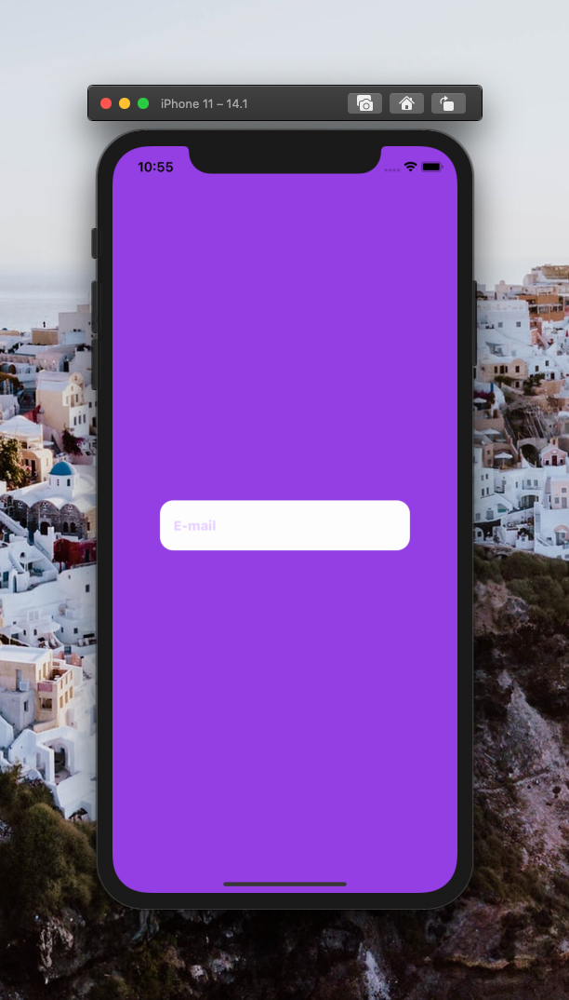

[](https://github.com/WrathChaos/react-native-text-input)

[](https://www.npmjs.com/package/@freakycoder/react-native-text-input)
[](https://www.npmjs.com/package/@freakycoder/react-native-text-input)

[](https://opensource.org/licenses/MIT)
[](https://github.com/prettier/prettier)

<p align="center">
  
</p>

<table>
  <tr>
    <td>
      <b>React Native TextInput</b>
    </td>
    <td>
      <b>React Native TextInput without button</b>
    </td>
  </tr>
 <tr>
    <td align="center">
      
    </td>
    <td align="center">
      
    </td>
   </tr>
</table>

# Installation

Add the dependency:

```bash
npm i @freakycoder/react-native-text-input
```

## Peer Dependencies

<h5><i>IMPORTANT! You need install them</i></h5>

```js
"@freakycoder/react-native-bounceable": "^0.2.4",
```

# Usage

## Import

```jsx
import RNTextInput from "@freakycoder/react-native-text-input";
```

## Fundamental Usage

```jsx
<RNTextInput
  placeholder="E-mail"
  onChangeText={(text: string) => console.log("Text: ", text)}
/>
```

## Without Button Usage

```jsx
<RNTextInput
  disableButton
  placeholder="E-mail"
  onChangeText={(text: string) => console.log("Text: ", text)}
/>
```

## Example Project 😍

You can checkout the example project 🥰

Simply run

- `npm i`
- `react-native run-ios/android`

should work of the example project.

# Configuration - Props

## Fundamentals

| Property      |   Type   |  Default  | Description                        |
| ------------- | :------: | :-------: | ---------------------------------- |
| onChangeText  | function | undefined | set the onChangeText functionality |
| disableButton | boolean  |   false   | disable right component button     |
| placeholder   |  string  | undefined | set the placeholder for text input |

## Customization (Optionals)

| Property       |    Type    |  Default  | Description                                                            |
| -------------- | :--------: | :-------: | ---------------------------------------------------------------------- |
| onPress        |  function  | undefined | set your own logic for the button functionality when it is pressed     |
| style          | ViewStyle  |  default  | set or override the style object for the main container                |
| buttonStyle    | ViewStyle  |  default  | set or override the style object for the button style                  |
| textInputStyle | TextStyle  |  default  | set or override the style object for the text input style              |
| iconImageStyle | ImageStyle |  default  | set or override the style object for the image icon style              |
| ImageComponent |   Image    |  default  | set your own component instead of default react-native Image component |
| inputRef       | reference  | undefined | set the TextInput reference for the programmatic usage                 |

## Future Plans

- [x] ~~LICENSE~~
- [ ] Write an article about the lib on Medium

## Author

FreakyCoder, kurayogun@gmail.com

## License

React Native Text Input is available under the MIT license. See the LICENSE file for more info.
